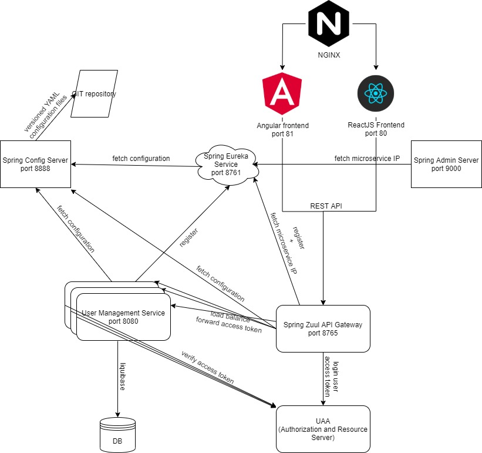

# Docker, UAA, Microservices, Spring Cloud, Spring Boot



The application structure is as follows.
- **uaa** - CloudFoundry User Account and Authentication (UAA) Server. [More info](https://github.com/cloudfoundry/uaa/blob/develop/README.md)
- **admin-server** - Microservice implemented using Spring Admin Server. [More info](admin-server/README.md)
- **config-server** - Microservice implemented using Spring Config Server. [More info](config-server/README.md)
- **eureka-discovery-service** - Microservice implemented using Spring Eureka. [More info](eureka-discovery-service/README.md)
- **zuul-gateway-service** - Microservice implemented using Spring Zuul. [More info](zuul-gateway-service/README.md)
- **user-management-service** - Microservice implemented using Spring boot. [More info](user-management-service/README.md)

### Build

#### 1) Build Spring Boot microservices
   
```
$ cd microservices path
$ mvnw clean install
$ mvnw spring-boot:run
```

#### 2) Build and run UAA server

```
$ cd uaa
$ docker build -f Dockerfile -t uaa .
$ docker run -d -it -p 8090:8090 uaa
```

### Access application using following URL

```
http://localhost:8765/api/user/service/login
```

### Docker

#### 1) Build all modules and docker images

```
mvnw clean deploy -P docker
```

#### 2) Run docker

```
docker-compose up -d
```
